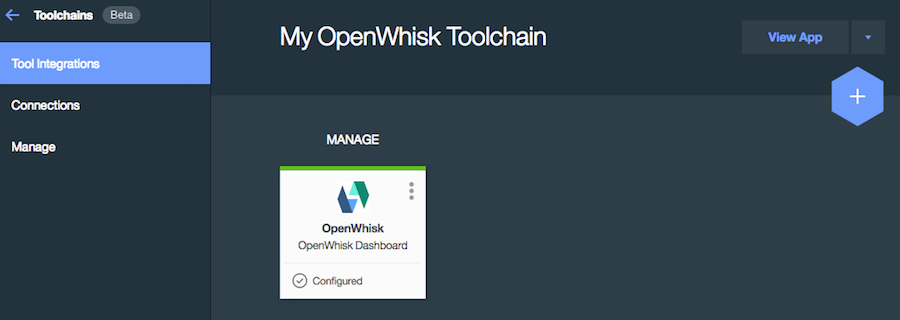

#Introducing custom tool integration for Bluemix toolchains

As the development lead for Bluemix toolchain templates, I'm on the front line working with our technical sales and developer advocate teams regularly. Their goal is to develop new tool combinations to illustrate various DevOps practices and my goal is to make sure that toolchains meet those needs.

Toolchains come with out-of-the-box support for a number of common third-party tools like GitHub and Slack. Toolchains also support more specialized Bluemix tools, like Delivery Pipeline, that help deploy your applications. The list of tools that toolchains support is growing rapidly. However, when we integrate directly with a customer's environment, we always find new tools that we need to integrate that are not in the toolchain catalog.

To integrate a new tool, we can go down the technical path and use the toolchain API to implement and contribute a tool broker, but there is a simpler approach that requires no coding or special hosting. If you only need to represent your tool visually on the toolchain and your initial tool integration needs are simple, using the custom tool integration is your best bet. This is surfaced in the toolchain catalog as a special catch-all integration called "Other Tool." 

I'll demonstrate the "Other Tool" option to add one of my favorite tools, [OpenWhisk](https://new-console.ng.bluemix.net/openwhisk/), to a toolchain.

To get started, go to [Bluemix Devops](https://new-console.ng.bluemix.net/devops/). If this is your first visit, I recommend that you take a quick look at the [Toolchain Getting Started](https://console.ng.bluemix.net/docs/toolchains/toolchains_overview.html) documentation.  

Let's create an empty toolchain to try this out.

1. From the DevOps Toolchains page click **[+]**
1. Select the "Build your own toolchain" template. 
1. On the next screen,  ive your toolchain a clever name like "My OpenWhisk Toolchain" and click **Create**.
1. After your toolchain is created, add our custom tool by clicking **[+]** and select **Other Tool**.

Fill the form as follows or however it makes sense for your custom tool. When done, click **Create Integration**.

The result is that you end up with a new tool card that represents this new custom integration on your toolchain.

This example showed the absolute simplest type of tool integration that's possible and is primarily used to provide basic visual cues that a tool is present in a particular toolchain. In terms of functionality this integration is little more than a glorified bookmark.

When creating this custom tool we left the field **Additional properties** blank. This field contains free-form text and can be used as the basis of some pretty powerful yet simple tool integrations -- the topic of my next post.

If you'd like more please take a look at the [custom tool documentation](https://console.ng.bluemix.net/docs/toolchains/toolchains_integrations.html#othertool)

